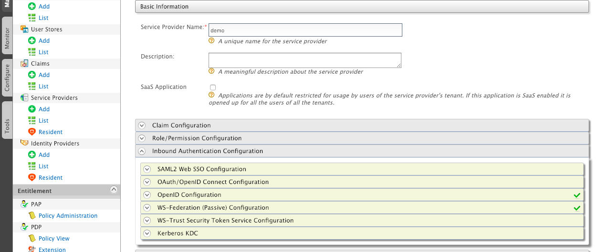
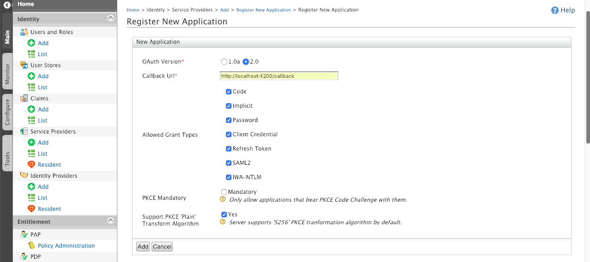

# SSO OAuth2 login with WSO2 IS

### Prerequisites

##### Installation of JAVA

```
$ sudo yum install java-1.8.0-openjdk-devel
```


##### Installation of WSO2 IS with KM (key manager)

```
$ sudo su
$ cd /opt
$ wget http://product-dist.wso2.com/downloads/api-manager/2.1.0/identity-server/wso2is-km-5.3.0.zip
$ unzip wso2is-km-5.3.0.zip
```


### Start identity server

```
$  /opt/wso2is-km-5.3.0/bin/wso2server.sh start
```

### Service provider configuration

* Login into https://localhost:9443/carbon 

> Note: wso2 default credentials admin/admin.

* Click on add to create a new service provider and then click on register

   https://localhost:9443/carbon/application/add-service-provider.jsp?region=region1&item=add_service_providers_menu

* Click on Inbound Authentication configuration and then configure OAuth/OpenID configuration
to generate client credentials



* Configure callback uri as http://localhost:4200/callback and click on Add button



####  Start the angular app

```
$ cd angular2-oauth2-login
$ npm install
$ npm run start
```


####  Test SSO navigation

1) Hit the browser http://localhost:4200

2) User will get redirected to WSO2 IS login page

3) Enter the credentials to login admin/admin.

4) Once login is successful, home page is shown with some inventories

### Configuration Guide

* OAuth2 endpoints are configured in environment.ts file.
Below endpoints can be modified as per the identity provider setup

```
export const environment = {
  production: false,
  sso: {
    clientId : '<<YOUR-CLIENT-ID>>',
    serverUrl: 'https://localhost:9443',
    issuer :  '/oauth2/token',
    redirectUri : window.location.origin + '/callback',
    scope: 'openid profile',
    tokenEndpoint:  '/oauth2/token',
    userinfoEndpoint:  '/oauth2/userinfo',
    authorizationEndpoint:  '/oauth2/authorize',
    jwksEndpoint: '/oauth2/jwks',
    showDebugInformation: true,
    requireHttps: false,
    responseType: 'id_token token'   
  }
};

```

* Users can also provide well known configuration uri but note it is protected as per wso2. 
you need to relax the rules to expose well known configuration uri.

```
this.oauthService.loadDiscoveryDocumentAndTryLogin();
```
[OpenID discovery](https://docs.wso2.com/display/IS530/OpenID+Connect+Discovery)

* Same goes with JWKS uri, enable JwksValidationHandler if jwks object is set as part of oauthconfig

```
this.oauthService.tokenValidationHandler = new JwksValidationHandler()
```
[JWKS configuration](https://docs.wso2.com/display/IS541/JSON+Web+Key+Set+Endpoint) <br>
[JWKS uri](https://localhost:9443/oauth2/jwks)

* OAuth2 default endpoints can be viewed under resident section 

```
Identity Provider Entity Id:	https://localhost:9443/oauth2/token
Authorization Endpoint URL:	https://localhost:9443/oauth2/authorize
Token Endpoint URL:	https://localhost:9443/oauth2/token
Token Revocation Endpoint URL:	https://localhost:9443/oauth2/revoke
Token Introspection Endpoint URL:	https://localhost:9443/oauth2/introspect
User Info Endpoint URL:	https://localhost:9443/oauth2/userinfo
Session IFrame Endpoint URL:	https://localhost:9443/oidc/checksession
Logout Endpoint URL:	https://localhost:9443/oidc/logout
```

